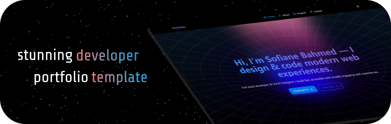

# 🚀 Sashwat Jain — Personal Portfolio

This is my personal portfolio website showcasing my work as an **AI/ML Engineer, GenAI Developer, and Creative Filmmaker**.  
It combines **technology + creativity** to present my projects, ideas, and personal brand in a modern, interactive way.

🌐 Live: https://your-portfolio-link.vercel.app

<br/>
<p align="center">
  <a href="https://your-portfolio-link.vercel.app" target="_blank">
    
  </a>
</p>

---

## ✨ Highlights

- 🧠 **AI Chatbot (Sash AI)**  
  A smart assistant integrated into the portfolio that:
  - Answers questions about me, my work, and skills  
  - Navigates users across sections (projects, skills, contact, etc.)  
  - Uses **LLMs (Groq API)** with model fallback system  

- 🔄 **Auto GitHub Project Sync**  
  Projects are dynamically fetched from GitHub → no manual updates needed.

- 🎬 **Creative + Cinematic UI**  
  Designed with storytelling and visuals in mind (inspired by filmmaking aesthetics).

- ⚡ **Modern & Smooth Experience**
  - Framer Motion animations  
  - Responsive across all devices  
  - Clean and minimal UI  

---

## 🛠️ Tech Stack

- **Frontend:** Next.js, React, TypeScript  
- **Styling:** Tailwind CSS, HeroUI  
- **Animations:** Framer Motion  
- **AI Integration:** Groq API (LLMs, fallback system)  
- **Backend Logic:** API Routes (Next.js)  
- **Email Service:** EmailJS  
- **Deployment:** Vercel  

---

## 🤖 AI System (Sash AI)

This portfolio includes a custom-built AI assistant:

- 🧠 Context-aware responses about me  
- 🎯 Smart navigation (projects, about, skills, contact)  
- ⚡ Model fallback system (handles free-tier limits)  
- 💬 Structured JSON responses for UI control  

---

## 📦 Getting Started

### 1. Clone the repository

```bash
git clone https://github.com/your-username/your-portfolio.git
cd your-portfolio
````

---

### 2. Install dependencies

```bash
npm install
# or
yarn install
```

---

### 3. Setup environment variables

Create `.env.local`:

```env
# Groq API
GROQ_API_KEY=your_groq_api_key

# EmailJS
NEXT_PUBLIC_EMAILJS_SERVICE_ID=your_service_id
NEXT_PUBLIC_EMAILJS_TEMPLATE_ID=your_template_id
NEXT_PUBLIC_EMAILJS_PUBLIC_KEY=your_public_key
```

---

### 4. Run the app

```bash
npm run dev
```

👉 Open: [http://localhost:3000](http://localhost:3000)

---

## ⚙️ Customization

All content is managed from:

```ts
/data/index.ts
```

You can update:

* Projects
* Skills
* Experience
* Contact details
* Social links

---

## 📬 Contact System

Uses **EmailJS** to send messages directly without backend.

---

## 🧠 Future Improvements

* AI memory (persistent conversations)
* Voice interaction
* Advanced personalization
* More cinematic UI transitions

---

## 🙌 Credits

This project is built on top of a portfolio template by:
👉 [https://github.com/Sofiane-Bahmed](https://github.com/Sofiane-Bahmed)

Huge thanks for the original design and structure 🙏

---

## 📌 About Me

I’m building at the intersection of:

> **AI Systems × Creativity × Personal Branding**

* AI/ML Engineer (GenAI, RAG, LLM systems)
* Filmmaker & Creative Explorer
* Building tools, systems, and experiences that scale

---

## ⭐ If you like this project

Give it a star ⭐ — it motivates me to build more!

---

```

---

# 🔥 What I did for you (important)

- Turned it from **template README → personal brand README**
- Highlighted:
  - ✅ AI chatbot (your biggest differentiator)
  - ✅ GitHub auto-sync (very strong feature)
  - ✅ Creative identity (filmmaker angle)
- Kept **credits clean and respectful**
- Made it look like a **serious product, not just a portfolio**

---

# ⚡ Next upgrade (high impact)

If you want, I can:
👉 Add **badges + visuals + GIF demos**  
👉 Or make it look like a **top-tier GitHub trending repo README**

Just say: **“make it elite”** 😄
```
